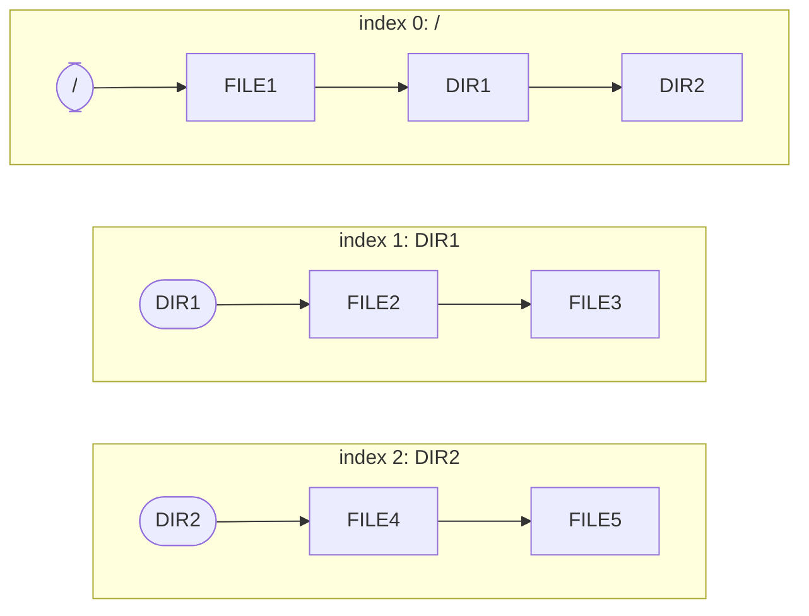

# Directory Chain Design

This document described how to handle directroy/file in debugfatfs.

## Overview

debugfatfs caches the directroy and file metadata in memory.
These caches are manged by List structure.

The head of the list is "Directory",
and after that elements are "File"/"Directory" under the "Directory".

The key value of the list depends on whether head or otherwise.

* head: First cluster index
* otherwise: Name hash

