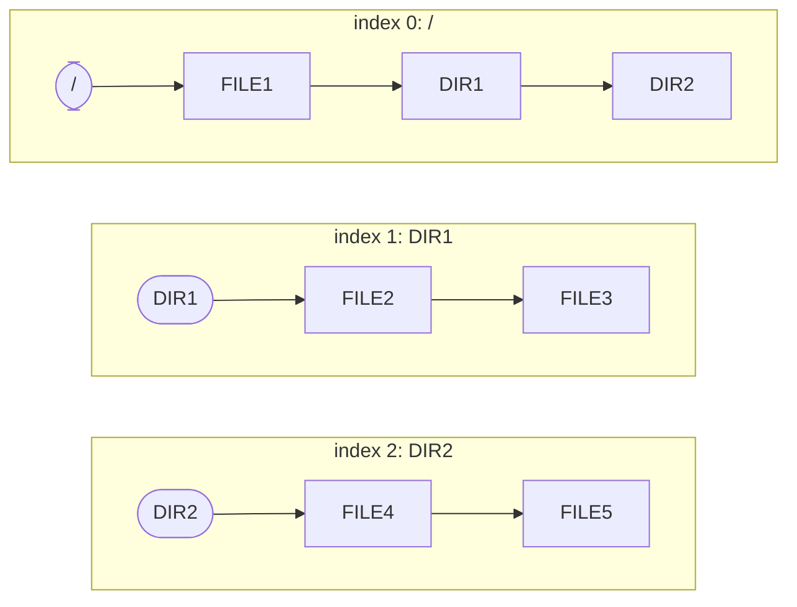

# Directory Chain Design

This document describes how debugfatfs caches directory and file metadata.

## Overview

debugfatfs caches directory and file metadata in memory while it traverses the image.
The cache is implemented with the list helpers in `include/list.h`.

The head of the list is "Directory",
and after that elements are "File"/"Directory" under the "Directory".

```mermaid
flowchart TB
  subgraph d1 ["index 0:  /"]
    direction LR
    a(["/"])
    a1["FILE1"]
    a2["DIR1"]
    a3["DIR2"]

    a -->a1
    a1-->a2
    a2-->a3
  end

  subgraph d2 ["index 1:  DIR1"]
    direction LR
    b(["DIR1"])
    b1["FILE2"]
    b2["FILE3"]

    b -->b1
    b1-->b2
  end

  subgraph d3 ["index 2:  DIR2"]
    direction LR
    c(["DIR2"])
    c1["FILE4"]
    c2["FILE5"]

    c -->c1
    c1-->c2
  end

  d1 ~~~ d2 ~~~ d3
```

The key value of each list node depends on its role.

* head: First cluster index
* otherwise: Name hash

## Ownership

The top-level directory cache is stored in `info.root`. Each element represents a directory chain.

- The head node stores metadata for the directory itself.
- Subsequent nodes store files and subdirectories directly contained by that directory.
- FAT and exFAT implementations keep filesystem-specific metadata in their own fileinfo structures.

## Lifecycle

Directory metadata is loaded on demand by lookup and readdir operations. Commands that change directory contents, such as `create`, `mkdir`, `remove`, `rmdir`, `trim`, and `fill`, reload the affected directory after writing the image.

At process shutdown, `free_dentry_list()` calls the filesystem-specific clean operation for each cached directory chain and then releases `info.root`.

## Notes

- The cache is an inspection and command helper; the filesystem image remains the source of truth.
- Paths are resolved from the current directory in interactive mode and from the root directory for command-line file metadata lookup.
- Name matching uses the filesystem implementation, so FAT long-file-name behavior and exFAT up-case behavior are handled below the shell layer.
